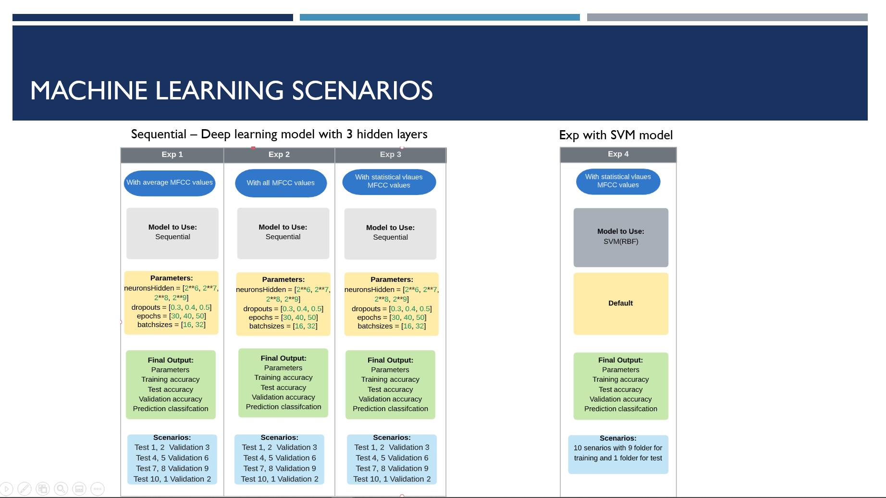

# Urban Sound Analysis using Machine Learning

The Urban Sound Analysis project looks at a dataset composed by J. Salamon, C. Jacoby and J. P. Bello, "A Dataset and Taxonomy for Urban Sound Research", 22nd ACM International Conference on Multimedia, Orlando USA, Nov. 2014.  We took the dataset and ran it through librosa libraries to convert the wav files into MFCC files.  The Mel-Frequency Cepstral Coefficients (MFCC) is a way of capturing the spectrun of the voice (phoneme) so that it can used in voice recognition and machine learning.  From the MFCCs we built a models through 2 different Machine Learning techniques (Sequential deep learning and Support Vector Machine).  The initial throught was that the Sequential deep learning model would provide the best model.  The following information provides a view of our process and what results we came up with.

## Team members:

* Niral Patel
* Eunjeong Lee
* Bill Pezzullo
* Abby Pearson
* Teshanee Williams

## Process:

We attacked the project by understanding sound and analyzing what happens in ML when looking at the pure data.  What we found is that the data was too complex to work effectively in the models.  We found that the condition of overfitting was ocurring.  This can be seen in the following  charts.  Where you see overfitting is on the error graph showing a large difference between the errors on the training versus the test.  Each sound file gets converted into an MFC vector which contains an array shape of 13, 44

There was multiple ways of attacking overfitting.

1) Change the architecture
	Adjust the neurons
	Adjust the number of layers
2) Data Augmentation
	Increase data input
	Apply transformation
	reducing vector size
	statistics
3) Early stopping
4) Drop-out
	Randomly drop neurons while training
	Increases network robustness
5) Regularization
	Adds penalty to errors
	Punish large weights
	L1 and L2 concepts

By adding the last two Drop-out and Regularization mthods we were able to improve the modeling.  We using regularization L2 at 0.001 and dropout of .4 in this example.

.png)

With this knowledge we continued with our attack on overfitting by creating 4 experiements.  

3 using Sequential deep learning with different augmented data as the input 
	1) Use the average of the vectors minimizing the vecor from 13 by 44 to 1 by 40.
	2) Maintaining the full shape of the MFCC, but adjusting the other model inputs to see the impact
	3) Using statistical values of the array reducing it to 30 x 6) 
	
and 1 experiment with Support Vector Module and using the statistical data since that was the of the Sequential experiements

## Results:

We found that using the statistical data both models Sequential and SVM performed similarly.  Based on the report of the test data, the SVM model actually performed more reliably.

### Data sources:

[J. Salamon, C. Jacoby and J. P. Bello, "A Dataset and Taxonomy for Urban Sound Research", 22nd ACM International Conference on Multimedia, Orlando USA, Nov. 2014](https://urbansounddataset.weebly.com/urbansound8k.html)

[J. Salamon, C. Jacoby and J. P. Bello, "Paper", 22nd ACM International Conference on Multimedia, Orlando USA, Nov. 2014](http://www.justinsalamon.com/uploads/4/3/9/4/4394963/salamon_urbansound_acmmm14.pdf)

[Urban Sound Classification by Ricky Kim](https://towardsdatascience.com/urban-sound-classification-part-1-99137c6335f9)

[YouTube video on Sampling](https://www.youtube.com/watch?v=yWqrx08UeUs&feature=youtu.be)

[YouTube Python series on Deep Learning with sound](https://www.youtube.com/watch?v=Oa_d-zaUti8)

